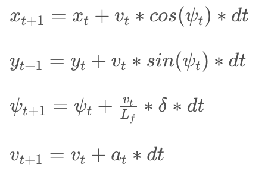
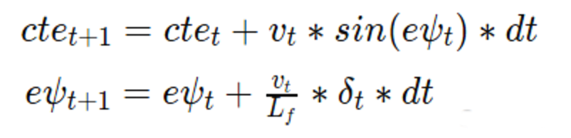

# Term-2-P5
# The Model (state, actuators and update equations)
The model implements the kinematic model which ignores tire forces, gravity and mass, as introcduced in the class. At low and moderate speeds, kinematic models often approximate the actual vehicle dynamics. The vehicle state vector includes the vehicle's x and y positions in global coordinates, current orienatation angle of the vehicle (ψ), velocity (v). The actuator vector includes the steering angle (δ) and the throttle rate (a). 

We learned from the class that the kinematic model predicts the state (t+1) as follows. 

The error terms (CTE and angle error) are updated as follows. 

# Timestep Lengeth (N) and Elapsed Duration (dt)
There comes a trade off between the N and dt. The larger N provides more accuracy but slows down the model. 
